<h3 align="center">⭐ End-to-End Data Analytics Project</h3>
<h1 align="center">📊 SAAS REVENUE AND CHURN ANALYSIS</h1>

  

**Project Title:** Saas Revenue and Churn Analysis Report

**Prepared by:** Farheen Muqadam

**Date:** 14-05-2026
 
---

## 1. Executive Summary  

- **Objective:** Analyze customer churn patterns across plans, acquisition channels, regions, and customer segments to identify key drivers and recommend retention strategies.
- **Overall Churn Rate:** The business is experiencing a high churn rate of 52.1%, indicating significant customer attrition and potential revenue loss.
- **Key Finding 1 (Plan-Based Risk):**
  - Starter plan shows the highest churn (71%), followed by Professional (48%).
  - Enterprise customers have the lowest churn (22.%). 
- **Key Finding 2 (Acquisition Channel Impact):**
  - Referral (61%) and Partner channels (58%) have the highest churn.
  - Direct Sales has the lowest churn (39%).
- **Key Finding 3 (Regional Risk):**
  - Latin America (62%) and Europe (55%) show the highest churn rates.
  - North America has the lowest churn (49%).  
- **Business Impact:** High churn in low-tier and certain acquisition channels is likely eroding revenue stability and increasing customer acquisition pressure 
- **Recommendation:**
  - Improve value proposition and onboarding for Starter & Professional plans
  -	Optimize acquisition strategy—reduce reliance on high-churn channels (Referral, Partners)
 --- 
## 2. Problem Statement  
CloudTask Pro, a SaaS company, has rapidly scaled its customer base from 0 to 600 customers since 2022. Despite strong revenue growth, the company is experiencing a relatively high churn rate, raising concerns among senior leadership regarding long-term sustainability and customer retention.
The CFO has specifically highlighted the need to better understand:
- Monthly churn trends and whether churn is increasing over time
- Customer segments that are most at risk of churning
- The company’s unit economics, including revenue per customer and the relationship between customer acquisition cost (CAC) and customer lifetime value (CLV)
This analysis aims to:
- Identify key drivers of churn across customer segments
- Evaluate churn patterns over time
- Assess business profitability through core SaaS metrics (MRR, CLV, CAC)
- Provide actionable recommendations to improve retention and optimize growth strategy
--- 
## 3. Data Overview
- **Data Source(s):** internal database (subscription, Monthly Revenue)
- **Time Period:** [e.g., Feb 2022 – Dec 2025]
- **Dataset Size:** Subscription (600 rows -17 columns), Revenue(49 rows- 8 columns)

**Key Variables:**
- plan
- billing_cycle
- Company_size
- Acquisition channel
- Region
- Monthly_revenue
- Churned_date
- Churned(yes/No)
- Nps_score
- Feature_usage Pct
- New_customers
- Churned_customers
- Average_revenue_per_customer
- Customer_acquisition_cost
- Total_mrr

---
 
## 4. Data Preparation
- **Duplicates removed:** Yes
- **Feature engineering:**
  - Churn flag(0,1)
  - Customer lifetime
  - CLV
  - Feature_usage_segment (high risk, medium risk, low risk)
  - CLV:CAC
  - New_mrr
  - Churned_mrr
  - Net_customer_growth
  
- **Tools used:**
  - Excel (Pivot tables, charts, calculated fields, formulas)

## 5. Exploratory Data Analysis (EDA)
### 5.1 Overall Trends
- Overall churn rate: 52.1%
- Churn rate show increasing trend overtime
- MRR shows increasing trend overtime despite the churn rate

### 5.2 Segment Analysis
- **By Plan Type:**
  - Highest churn is observed in Starter plan (70.5%), followed by Professional (48%)
  - Enterprise customers show the lowest churn (22%), indicating stronger retention among higher tier user
- **By Acquisition Channel:**
  - Customers acquired via Referral (61.3%) and Partner channels (58%) exhibits highest churn rates
  - Direct Sales customers have the lowest churn(39.3%) ,suggesting higher-quality acquisitions
- **By Region:**
  - Latin America (61.7%) and Europe (54.9%) shows the highest churn rates
  - North America (48.9%) has the lowest churn, indicating better retention performance in this region
- **By Company Size:**
  - Customers with 500+ employees (63.2%) and 1-10 employees (56.7%) show elevated churn rates
  - Mid segments (51-200 employees) demonstrate relatively lower churn (42.6%)

### 5.3 Distribution Analysis
- The customer base is distributed across multiple segments, with a significant concentration in medium-risk (254 customers) and high-risk (223 customers) categories.
- Churn distribution is skewed toward:
  - Lower-tier plans (Starter)
  - Certain acquisition channels (Referral, Partner)
  - Specific regions (Latin America, Europe)

→ This indicates that churn is not random but concentrated in identifiable high-risk segments.

---
 
## 6. Key Insights
### Insight 1: Churn is concentrated in lower-tier plans
- **Observation:** Starter plan has the highest churn rate (60.2%) compared to Enterprise (22.2%) and Business (27.4%)
- **Evidence:** as shown in chart below starter plan churn(70%) is significantly higher than enterprise(22%)
  
  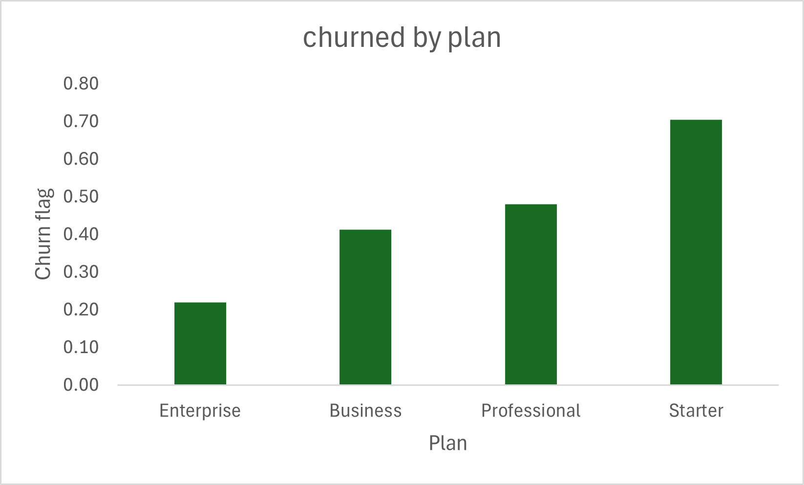
  
- **Business Meaning:** Lower-tier customers likely perceive lower value or are more price-sensitive, making them more likely to churn. This suggests a gap in value delivery or onboarding for entry-level users

### Insight 2: Acquisition channel significantly impacts customer quality
- **Observation:** Customers acquired via Referral (61.3%) and Partner channels (58%) show the highest churn, while Direct Sales (39.3%) has the lowest churn.
- **Evidence:** Referral (61.3%) vs Direct Sales (39.3%) as shown in the chart below

  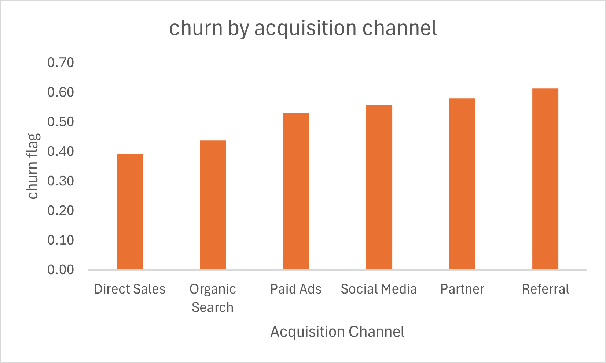
  
- **Business Meaning:** Not all acquisition channels bring high-quality customers. Heavy reliance on high-churn channels increases acquisition costs and reduces long-term profitability.

### Insight 3: Billing cycle significantly impacts churn
- **Observation:** Customers on the monthly billing cycle (~60%) have a significantly higher churn rate compared to those on the annual billing cycle (~40.3%).
- **Evidence:** Billing cycle segmentation from the chart shows a clear gap in churn rates between monthly and annual subscribers. (Refer to Chart: Churn Rate by Billing Cycle)

  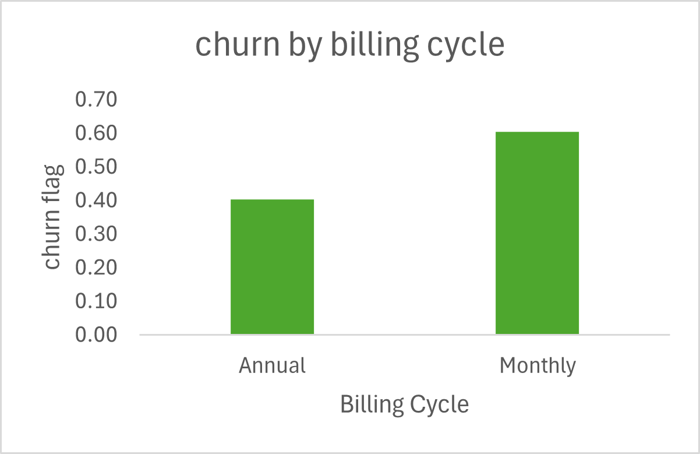
  
- **Business Meaning:** Customers on monthly plans have lower commitment and can churn more easily, while annual plans create stronger retention through longer-term contracts. This indicates an opportunity to shift customers toward annual plans to improve retention and revenue predictability.

### Insight 4: Churn is geographically concentrated
- **Observation:** Latin America (61.7%) and Europe (54.9%) have significantly higher churn compared to North America (48.9%)
- **Evidence:** Latin America (61.7%) vs North America (48.9%) as shown in the chart below

  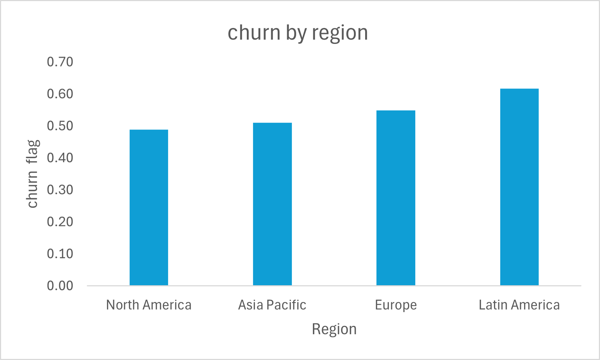
  
- **Business Meaning:** Regional factors such as pricing sensitivity, competition, or product-market fit issues may be driving churn, requiring localized strategies

### Insight 5: Mid-to-large companies show unexpectedly high churn
- **Observation:** Companies with 500+ employees (~63.2%) and 1-10 employees (~56.7%) exhibit higher churn than mid segments
- **Evidence:** 500+ employees (~63.2%) vs 51-200 employees (~42.6%)

  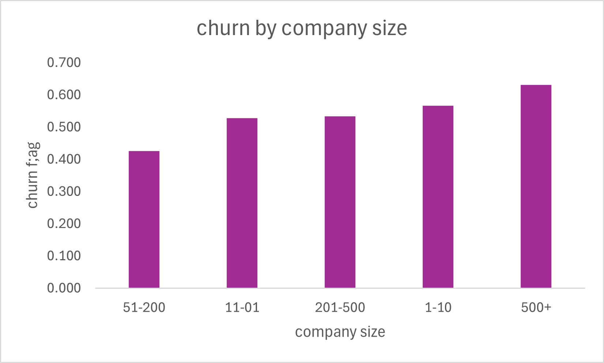
  
- **Business Meaning:** Larger customers may have higher expectations (features, support, customization). Failure to meet these expectations increases churn risk despite higher revenue potential.

### Insight 6: Churn is driven by both economic and product factors
- **Observation:** Top churn reasons include Budget Cuts (53), Price too High (51), and Company closed (48)
- **Evidence:** Budget Cuts (53) and price too high (51) highest churn reason as shown in chart

  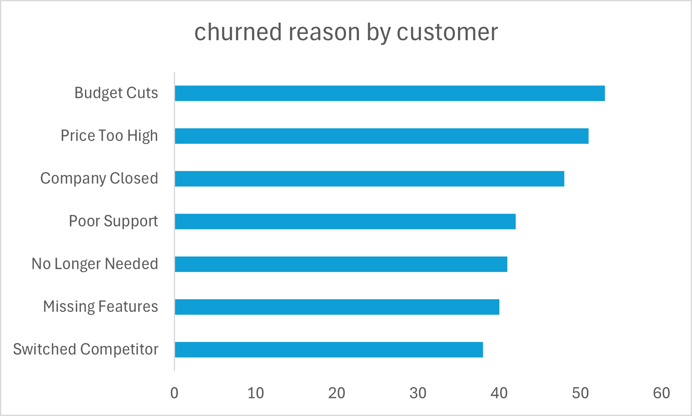
  
- **Business Meaning:** Churn is not caused by a single factor—both macroeconomic conditions and product gaps must be addressed to improve retention.

---

## 7. Key Metrics &amp; KPIs

| Metric | Value | Explanation |
|------------------|--------|--------------------------------|
| Total Customers | 600 | Total user base |
| Churn Rate | 52.1% | % customers lost |
| Revenue / MRR | $292628.6 | Monthly recurring revenue |
| CLV | $15965.92 | Customer lifetime value |
| CAC | 200 | Customer acquisition cost |
| CLV:CAC | 79.8:1 | Profitability ratio |

---

## 8. Visualizations

- **Chart 1:** The chart shows that churned customers are increasing at a faster rate than new customer acquisitions.

  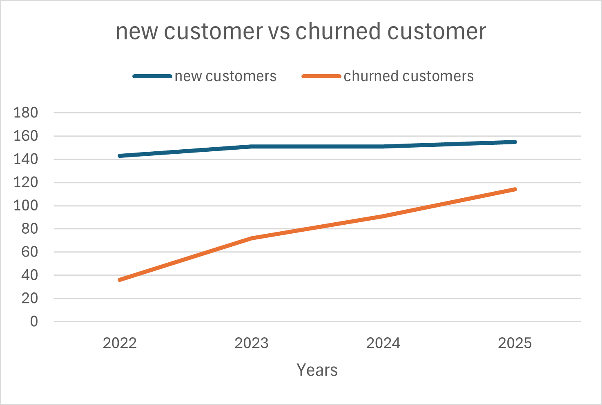
  
- **Chart 2:** MRR shows a steady upward trend over the observed period, indicating consistent revenue growth despite high churn rate

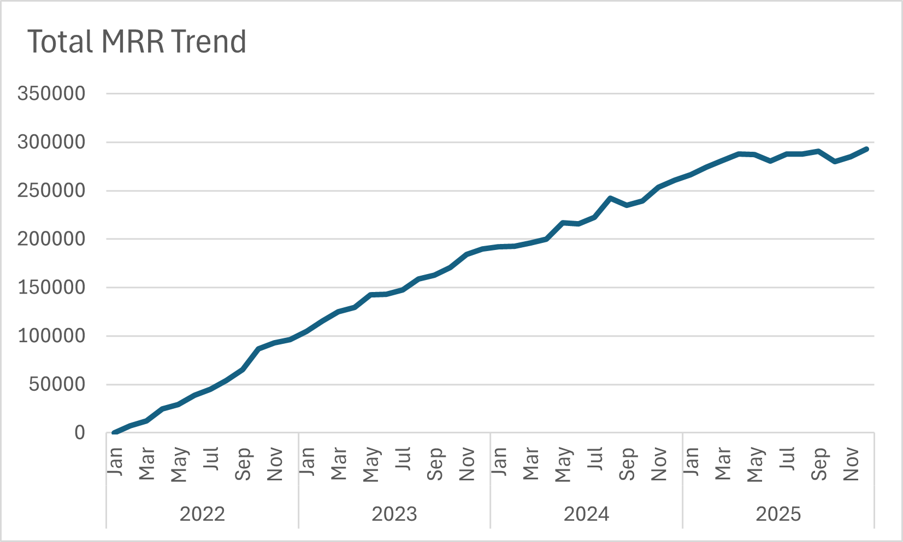

- **Chart 3:** The enterprise plan generates the highest CLV ,whereas the starter plan contributes the least

  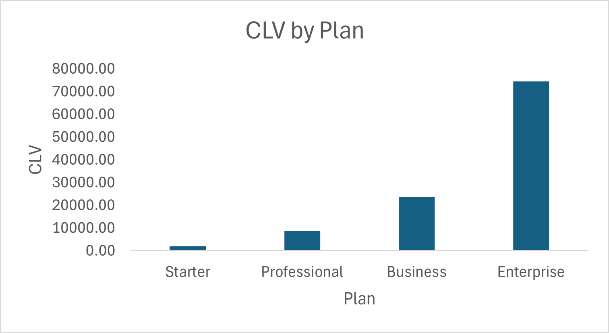
  
- **Chart 4:** The pie chart shows that 42% of customers fall under the medium risk segment,37% under high risk, and 21% under low risk.

  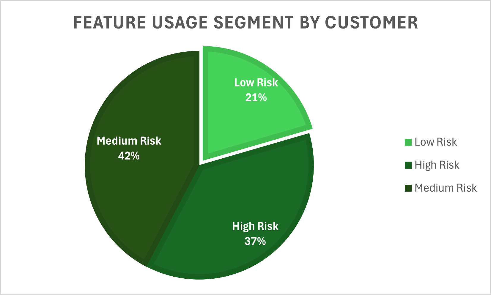

## 9. Dashboard overview

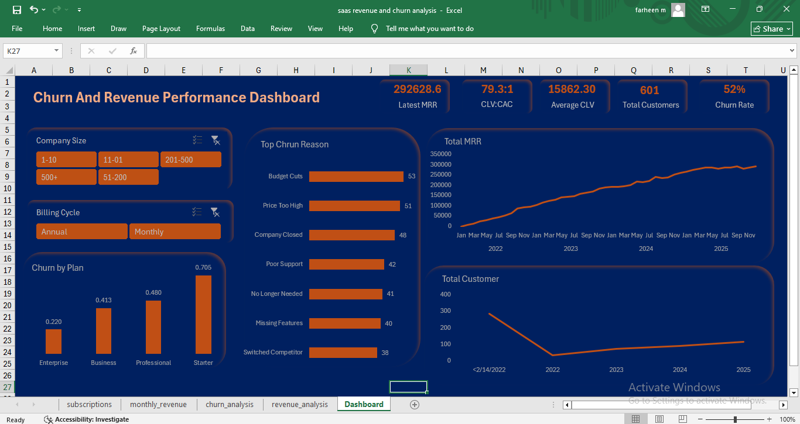

## 9. Recommendations

### Recommendation 1: Improve value proposition and onboarding for lower-tier plans
- **Action:**
  - Enhance onboarding for Starter & Professional users
  - Introduce feature improvements / guided usage
  - Introduce feature bundling or limited premium features in lower-tier plans
- **Expected Impact:**
  - Reduce Starter churn from 70.2% → ~62-64% (10–15% relative reduction)
  - Improve overall churn rate from 52.1% → ~47-49%
  - Increase CLV of Starter users (currently lowest) by ~10–20%

### Recommendation 2: Optimize acquisition strategy toward high-quality channels
- **Action:**
  - Shift focus from Referral (61.3% churn) & Partner (58%)
  - Invest more in Direct Sales (39.3%)
- **Expected Impact:**
  - Reduce overall churn by ~3–5% by improving customer quality
  - Improve CLV:CAC ratio beyond current ~79:1
  -	Increase retention of newly acquired customers by ~20–30%

### Recommendation 3: Promote annual billing to improve retention
- **Action:**
  - Offer discounts or incentives for switching from monthly to annual plans
  - Highlight cost savings and long-term value in pricing communication
- **Expected Impact:**
  - Reduce churn from ~60% (monthly) toward lower annual churn (~40%)
  - Improve revenue predictability and customer lifetime value
  
### Recommendation 4: Implement region-specific retention strategies
- **Action:**
  - Focus on Latin America (61.7%) & Europe (54.9%)
  - Adjust pricing / support / localization
- **Expected Impact:**
  - Reduce churn in underperforming regions
  - Improve global retention consistency

### Recommendation 5: Address product and support gaps
- **Action:**
  - Prioritize feature development based on “Missing Features” feedback
  - Strengthen customer support responsiveness and quality
- **Expected Impact:**
  - Reduce product-related churn drivers (~40 missing features, ~42 poor support)
  - Improve customer satisfaction and retention

### Recommendation 6: Target high-risk customers proactively
- **Action:**
  - Identify high-risk customers (223 customers) and run retention campaigns (emails, offers, check-ins)
  - Use engagement tracking to intervene early
- **Expected Impact:**
  - Reduce churn in most vulnerable segments
  - Improve overall retention rate
  
---

## 10. Limitations

- Data limitations: Analysis based on historical data only
- Assumptions made: Assumptions made in segmentation
- Potential biases: No behavioral data (e.g. ,app usage depth) included

---

